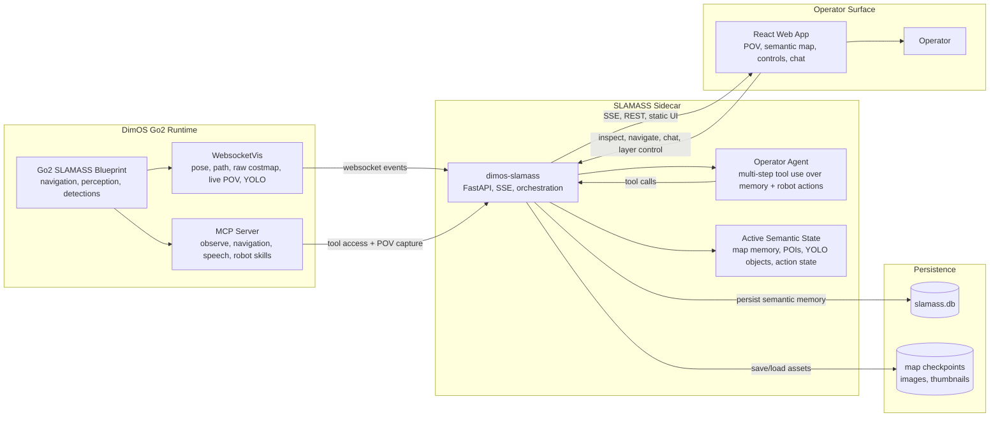

# DimOS + SLAMASS

This is our standalone contribution fork of DimOS centered on **SLAMASS**: `Semantic Localization and Mapping with Agentic Spatial Search`, a semantic spatial-memory system and operator dashboard for a Unitree Go2 that was built for ETH Robotics Club HACK26 on top of the existing DimOS stack.

The work here spans both sides of the feature:

- the standalone `dimos-slamass` service in [dimos/slamass](dimos/slamass/README.md)
- the React operator UI in [dimos/web/slamass-app](dimos/web/slamass-app/README.md)
- the Go2 integration blueprint in [dimos/robot/unitree/go2/blueprints/agentic/unitree_go2_slamass_mcp.py](dimos/robot/unitree/go2/blueprints/agentic/unitree_go2_slamass_mcp.py)

SLAMASS combines:

- a live first-person robot feed
- a persisted top-down SLAM map
- VLM-backed semantic points of interest
- YOLO-promoted persistent world objects
- click-to-navigate and "go back to that thing" flows
- a tool-using chat agent that can chain retrieval, inspection, UI/runtime control, speech, and robot actions across multiple steps
        
> Scope note: this repo still contains the broader DimOS codebase because SLAMASS is a real full-stack robotics integration across robot middleware, perception, persistence, agent tooling, and a web UI. I am not claiming sole authorship of the whole platform; this fork is focused on the SLAMASS work I contributed on top of it.

## Start Here

- [SLAMASS service README](dimos/slamass/README.md)
- [SLAMASS webapp README](dimos/web/slamass-app/README.md)
- [Go2 SLAMASS quickstart](docs/development/go2_slamass_quickstart.md)

## What SLAMASS Does

- builds a persistent semantic memory layer on top of the robot's existing navigation stack
- stores both sparse VLM scene anchors and denser YOLO object anchors in world coordinates
- lets an operator inspect, search, select, and revisit remembered places through a browser UI
- exposes a constrained chat agent that reasons over saved memory and safe robot actions instead of raw low-level control
- keeps the demo grounded: every semantic item is tied to a real captured image and a real saved pose

## UI Snapshot

One Hack26 snapshot of the dashboard in use, included mainly to show the combined POV, semantic map, and operator rail layout:


## Architecture



## Repo Guide

| Area | Path | Why it matters |
| --- | --- | --- |
| SLAMASS service | [`dimos/slamass/service.py`](dimos/slamass/service.py) | FastAPI sidecar, MCP client, websocket ingestion, persistence, SSE updates |
| Chat agent | [`dimos/slamass/chat_agent.py`](dimos/slamass/chat_agent.py) | Tool-using multi-step agent that plans over semantic memory and safe robot actions |
| Storage + map memory | [`dimos/slamass/storage.py`](dimos/slamass/storage.py), [`dimos/slamass/map_memory.py`](dimos/slamass/map_memory.py) | SQLite assets, map checkpoints, semantic item persistence |
| Webapp | [`dimos/web/slamass-app/src/App.tsx`](dimos/web/slamass-app/src/App.tsx) | Frontend state orchestration and operator interactions |
| Map UI | [`dimos/web/slamass-app/src/MapPane.tsx`](dimos/web/slamass-app/src/MapPane.tsx) | Semantic map rendering, camera, selection, click-to-nav |
| Go2 wiring | [`dimos/robot/unitree/go2/blueprints/agentic/unitree_go2_slamass_mcp.py`](dimos/robot/unitree/go2/blueprints/agentic/unitree_go2_slamass_mcp.py) | Connects Go2, 3D detections, MCP, and websocket outputs |

## Quick Start

Known-good local flow from the repo root:

```bash
source .venv/bin/activate
uv sync --all-extras --no-extra dds

cd dimos/web/slamass-app
npm ci
npm run build

cd "$(git rev-parse --show-toplevel)"
dimos --simulation --viewer none run unitree-go2-slamass-mcp --daemon

export OPENAI_API_KEY=...
dimos-slamass
```

Then open `http://localhost:7780`.

For a fuller walkthrough, smoke test, and persistence checks, see [docs/development/go2_slamass_quickstart.md](docs/development/go2_slamass_quickstart.md).

## Why The Rest Of The Repo Exists

DimOS provides the substrate SLAMASS plugs into:

- typed module streams and blueprint composition
- robot-specific stacks for the Unitree Go2 and other hardware
- the MCP server and agent-facing skills
- shared perception, navigation, and transport infrastructure

If you want the platform context behind the feature, the most useful references are:

- [docs/usage/modules.md](docs/usage/modules.md)
- [docs/usage/blueprints.md](docs/usage/blueprints.md)
- [docs/usage/cli.md](docs/usage/cli.md)
