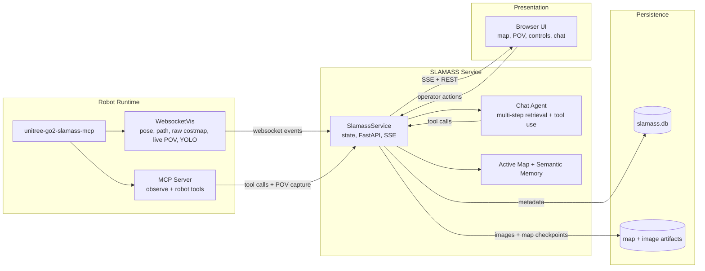

# SLAMASS Service

`dimos-slamass` is the standalone sidecar behind **SLAMASS** (`Semantic Localization and Mapping with Agentic Spatial Search`), turning a running DimOS Go2 stack into an operator-facing semantic mapping system.

It sits between the robot runtime and the browser UI:

- ingests pose, path, raw costmap, and YOLO world detections from the websocket visualization stream
- pulls robot capabilities and live POV frames from MCP
- runs manual inspection with OpenAI vision
- persists semantic items, map checkpoints, thumbnails, and full images
- exposes a FastAPI API plus SSE event stream for the UI
- serves the compiled React frontend

## High-Level Data Flow



## Main Responsibilities

- maintain the active top-down map from live `raw_costmap` updates
- manage two semantic memory layers:
  - VLM POIs created from explicit inspections
  - YOLO objects promoted from repeated 3D detections
- keep browser state synchronized through `/api/events`
- provide safe robot actions such as semantic navigation, map save, speech, and inspection
- host the multi-step chat agent that can chain semantic retrieval, inspection, UI/runtime control, and safe robot actions

## Key Files

- [`service.py`](service.py): FastAPI app, websocket/MCP integration, state machine, REST and SSE endpoints
- [`chat_agent.py`](chat_agent.py): multi-step SLAMASS chat agent and exposed tool schema
- [`storage.py`](storage.py): SQLite persistence and asset management
- [`map_memory.py`](map_memory.py): active occupancy memory and preview rendering
- [`yolo_protocol.py`](yolo_protocol.py): YOLO transport payloads consumed from the robot stack

## Important Endpoints

- `GET /api/snapshot`: full runtime snapshot for initial page load
- `GET /api/ui`: operator UI state
- `GET /api/chat`: chat state snapshot
- `GET /api/events`: SSE stream for live updates
- `GET /api/pov/latest.jpg`: latest POV frame
- `GET /api/map/preview.png`: current map preview
- `POST /api/inspect`: run manual inspection
- `POST /api/navigate`: click-to-go navigation
- `POST /api/chat/messages`: submit chat message
- `POST /api/map/save`: persist the active map

## Storage Layout

SLAMASS persists state under `~/.local/state/dimos/slamass/` by default:

- `slamass.db`: semantic metadata and references
- `maps/active_map.npz`: persisted occupancy memory
- `maps/active_map.png`: rendered preview
- `images/*.jpg`: saved full images and thumbnails

## Running It

From the repo root:

```bash
source .venv/bin/activate
uv sync --all-extras --no-extra dds

cd dimos/web/slamass-app
npm ci
npm run build

cd "$(git rev-parse --show-toplevel)"
dimos --simulation --viewer none run unitree-go2-slamass-mcp --daemon

export OPENAI_API_KEY=...
dimos-slamass
```

The service listens on `http://localhost:7780` by default.

## Related Code

- [`../robot/unitree/go2/blueprints/agentic/unitree_go2_slamass_mcp.py`](../robot/unitree/go2/blueprints/agentic/unitree_go2_slamass_mcp.py)
- [`../web/slamass-app/README.md`](../web/slamass-app/README.md)
- [`../../docs/development/go2_slamass_quickstart.md`](../../docs/development/go2_slamass_quickstart.md)
